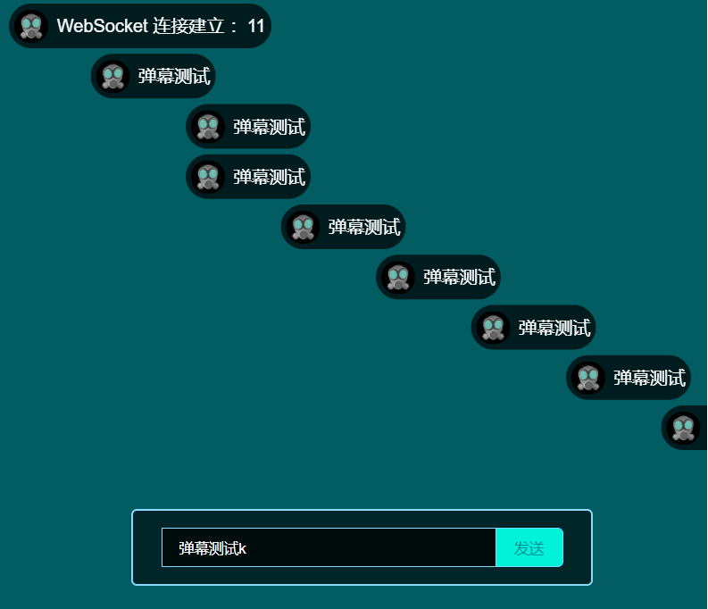

# danmu-websocket
弹幕demo，swoole，websocket

本项目需要先安装swoole扩展。

演示地址：[http://danmu.qiyewei.cn](http://danmu.qiyewei.cn/)

前端代码：https://github.com/tianming01/danmu-vue

演示图片：



## nginx配置：

```
server
{
    listen 80;
    server_name danmu.qiyewei.cn;
    index index.html index.htm;
    root /www/wwwroot/danmu;
    location /ws {
        proxy_pass http://127.0.0.1:9599;
        # this magic is needed for WebSocket
        proxy_http_version  1.1;
        proxy_set_header    Upgrade $http_upgrade;
        proxy_set_header    Connection "upgrade";
        proxy_set_header    Host $http_host;
        proxy_set_header    X-Real-IP $remote_addr;
    }
    access_log  /www/wwwlogs/danmu.qiyewei.cn.log;
    error_log  /www/wwwlogs/danmu.qiyewei.cn.error.log;
}
```